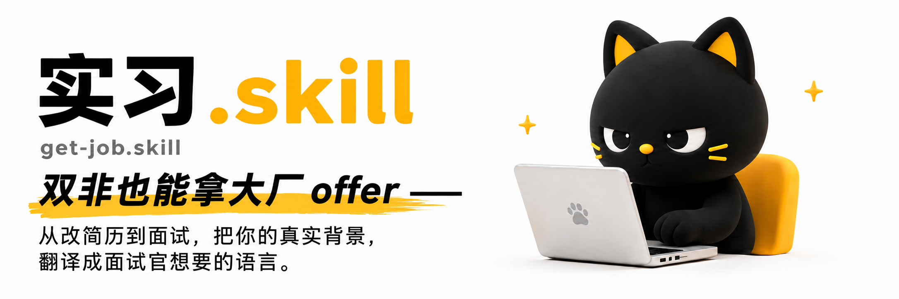
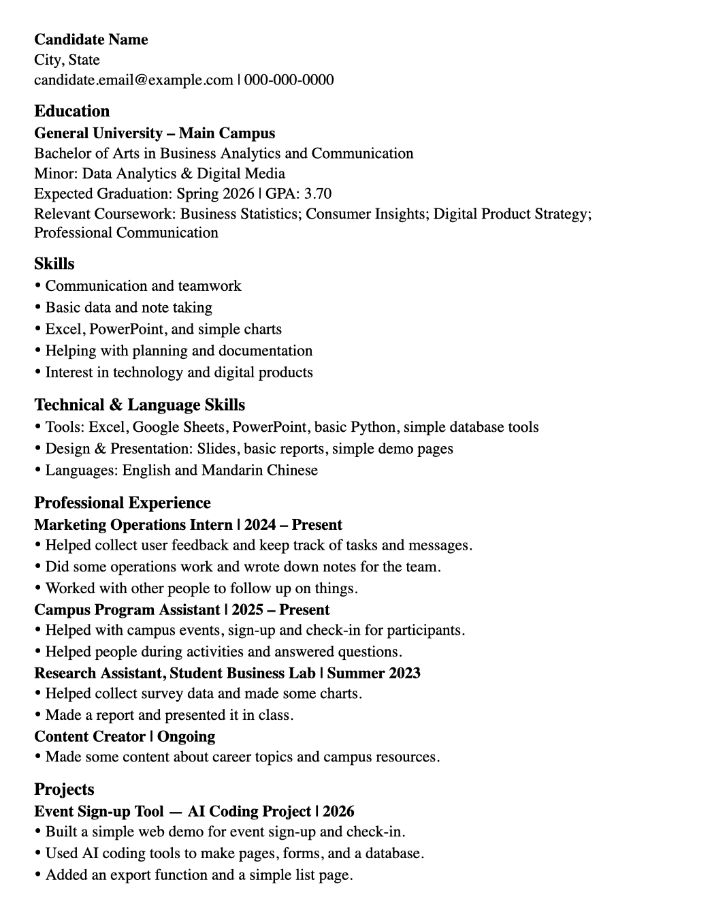
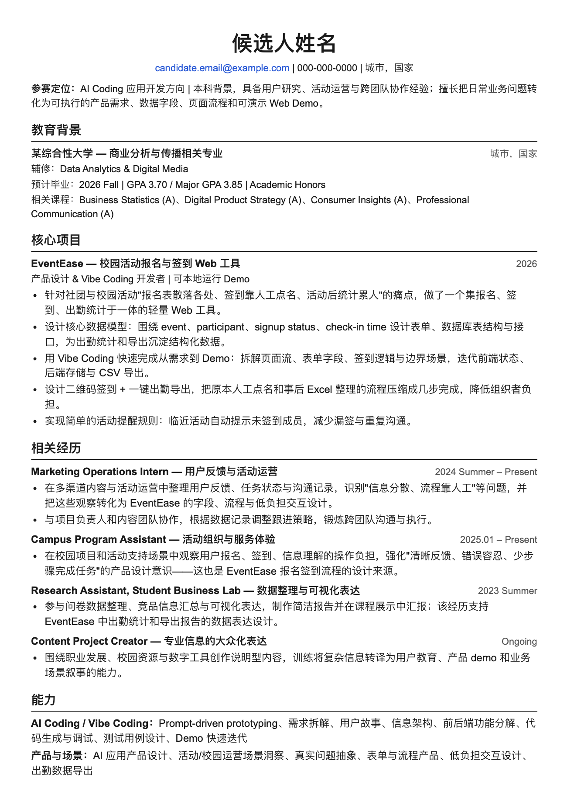
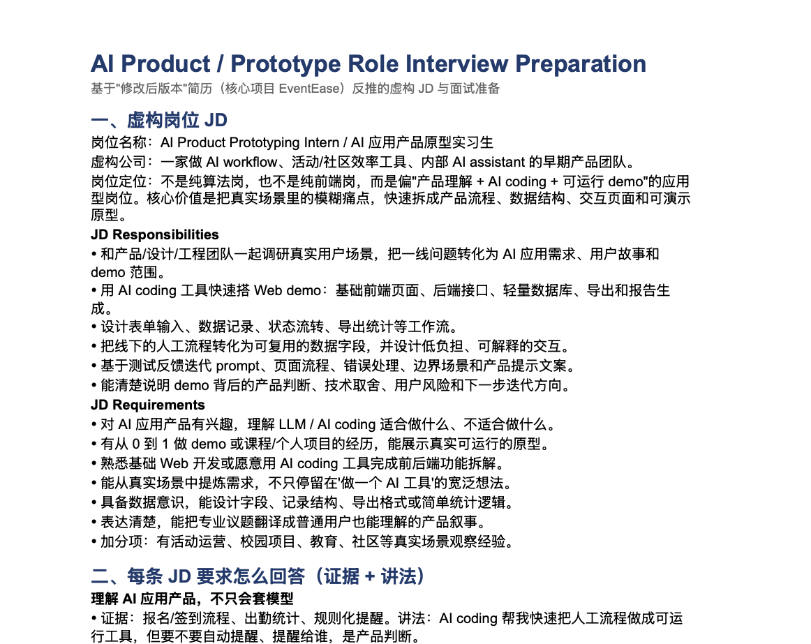
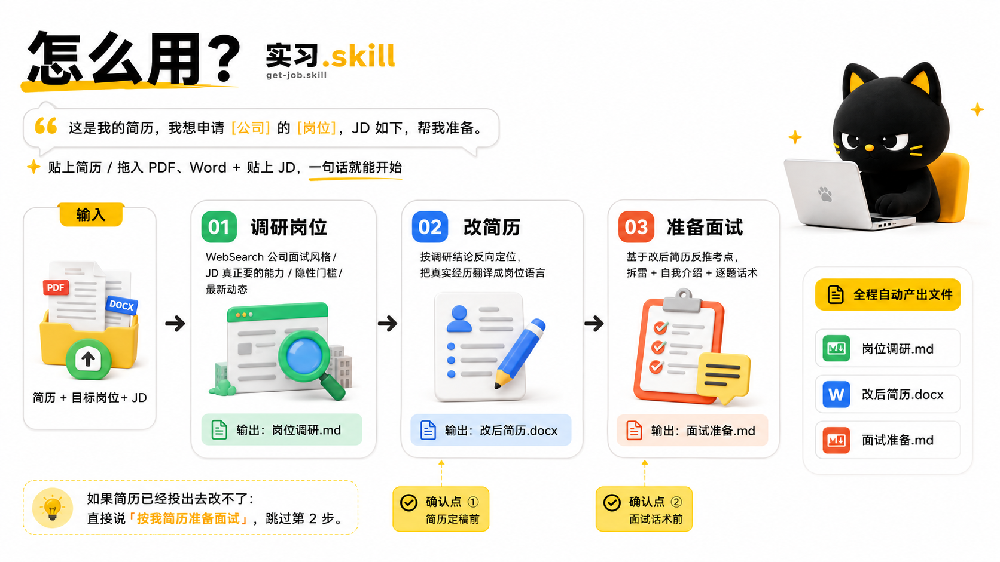

<div align="center">

# 实习.skill



<h3>双非也能拿大厂 offer —— 从改简历到面试，把你的真实背景，翻译成面试官想要的语言。</h3>

[](LICENSE)
[](https://agentskills.io)
[](#安装)

**你的全流程求职 agent**

[它能做什么](#它能做什么) · [效果示例](#效果示例) · [怎么用](#怎么用) · [示例成品](#示例成品) · [工作原理](#工作原理) · [安装](#安装)

</div>

---

## 它能做什么

求职最难的不是没经历，是**经历跟目标岗位看起来没关系**，或者**简历改得再花面试一追问就崩**。这个 skill 把整条链路走完，缺一不可：

| 阶段           | 做什么                                                                             | 产出            |
| -------------- | ---------------------------------------------------------------------------------- | --------------- |
| **① 调研岗位** | 按目标市场选择本地来源，用 WebSearch + 来源分级摸清岗位要什么：核心能力关键词、隐性门槛、最新动态 | `岗位调研.md`   |
| **② 改简历**   | 目标岗位反向定位 + 把真实经历翻译成岗位语言，克制使用迁移叙事，一键生成 docx       | `改后简历.docx` |
| **③ 准备面试** | 根据调研发现的真实轮次拆文件 + 每个 bullet 逐条讲解 + 证据化审计拆雷，让你被追问也不崩 | `面试准备/`   |

每段的产出都是下一段的输入。**方向错了，简历改得再漂亮也没用。**

教育学能投金融、心理学能进 AI、文科生能做互联网运营——靠的不是编经历，是翻译。

---

## 效果示例

同一个人的简历，改之前 vs 改之后。经历一个字没编，只是翻译成了目标方向听得懂的语言。

<table>
<tr>
<td width="50%" align="center"><b>❌ 改之前</b><br/><sub>语言堆动作、格式无定位、内容看不出和岗位的关系</sub></td>
<td width="50%" align="center"><b>✅ 改之后</b><br/><sub>定位头 + 痛点→产品决策→可演示 Demo + 统一专业排版</sub></td>
</tr>
<tr>
<td></td>
<td></td>
</tr>
</table>

> 上面这对前后简历示例在 [`examples/文科投AICoding/`](examples/文科投AICoding/)（内容全部泛化，仅作演示）。

再往后，它会基于改后的简历反推岗位、生成一套**分轮次 + 逐 bullet 面试准备**（节选）：

<div align="center">

</div>

> 完整面试准备示例在 [`examples/文科投AICoding/`](examples/文科投AICoding/)。

**这就是这个 skill 做的事：不编经历，把你已经有的东西翻译到位，再帮你准备到面试不崩。**

---

## 怎么用

<div align="center">

</div>

装好 skill 后，把简历和目标岗位**直接 copy-paste 丢给它**，一句话就行：

> 这是我的简历 `[贴上简历内容 / 拖入 PDF/Word]`，我想申请 `[公司]` 的 `[岗位]`，JD 如下 `[贴上 JD]`，帮我准备。

然后它会自动走三步，全程产出文件：

1. **调研岗位** — 先判断目标国家/地区，再用本地招聘源、面经源和官方源搜索岗位能力、隐性门槛和最新动态，并标注来源覆盖 → `岗位调研.md`
2. **改简历** — 按调研结论反向定位，把你的真实经历翻译成岗位语言，生成一份排版好的简历 → `改后简历.docx`
3. **准备面试** — 基于调研和改后简历发现实际有几轮、每轮看什么，把每个 bullet 的讲解、追问、证据和兜底逐条准备好 → `面试准备/`

中间会有关键确认点（简历定稿前、逐 bullet 深挖表/分轮次话术前），你过一眼对不对再继续。简历已经投出去改不了，就直接说"按我简历准备面试"，跳过第 2 步。

---

## 示例成品

`examples/` 下每个文件夹就是**一次完整成品**——以岗位命名，含完整交付物（全部虚构，看不出真实背景）：

| 示例                                       | 跨度                  | 看点                                                         |
| ------------------------------------------ | --------------------- | ------------------------------------------------------------ |
| [文科投AICoding](examples/文科投AICoding/) | 文科/Care → AI Coding | **含改前/改后简历截图 + 面试准备**，一眼看懂怎么改、什么格式 |
| [文科生投运营](examples/文科生投运营/)     | 文科 → 互联网运营     | 把"学生工作"翻译成运营能力                                   |
| [非科班投AI产品](examples/非科班投AI产品/) | 非科班 → AI 产品      | 简历有水分时，面试怎么拆雷不崩                               |

每个文件夹里：

```
文科生投运营/
├── 岗位调研.md      # ① WebSearch 调研结果
├── 改后简历.md      # ② 改写后的简历成品
└── 面试准备/        # ③ 总览 + 按真实轮次生成的准备文件
    ├── 00-总览.md
    ├── 01-简历bullet逐条深挖.md
    ├── 02-{已确认或高置信轮次名}.md
    └── ...
```

---

## 仓库结构

```
get-job/
├── SKILL.md                      # 三段链路主流程（agent 读这个）
├── references/
│   ├── resume-playbook.md        # 改简历方法：目标定位 + 能力迁移翻译
│   └── interview-playbook.md     # 面试方法：轮次地图 + 逐 bullet 深挖 + 证据化审计 + 话术
├── scripts/
│   ├── generate_resume.py        # 把改好的内容渲染成统一模板 docx
│   ├── sample_resume.json        # 输入示例
│   └── README.md                 # 脚本用法
├── assets/                       # README 用的图（hero / 怎么用 / 前后简历 / 面试准备截图）
└── examples/                     # 完整成品（虚构）
    ├── 文科投AICoding/           # 含改前/改后简历截图 + 面试准备文件
    ├── 文科生投运营/
    └── 非科班投AI产品/
```

---

## 工作原理

### 核心信念：翻译，不是造假

大多数人改简历的误区是**堆关键词**或**照时间平铺**，让招聘的人自己去找匹配点——他不会找。这个 skill 的内核是：

1. **目标岗位反向定位**——先从 JD 反推这个岗位要的 3-5 个核心能力，当作靶心。
2. **能力迁移翻译**——把真实经历用目标岗位的语言重述；跨行明显时，少量、自然地点明可迁移性，而不是每段都贴"迁移句"。
3. **按真实轮次逐 bullet 面试准备**——面试官会顺着简历追问两三层，提前把每个 bullet 的对应讲解、背景、角色、动作、数据口径、二三层追问和兜底都准备好；轮次文件只为用户已确认或 Web Search 高置信发现的轮次生成。

### 诚实底线（不可逾越）

- **翻译 ≠ 造假**：换角度讲做过的真事是翻译；写没做过的事是造假，一追问就崩。
- **迁移要有真实锚点**：每个"可迁移能力"都对应一件真做过的事。
- **Rail 不是保证**：skill 会追问证据和标注风险，但不能替用户证明输入一定诚实；没有细节支撑的 claim 不能当强事实写。
- **模糊化 ≠ 撒谎**："测算方式记不准了"是诚实承认记不清，不是编新谎。
- **背调红线绝不碰**：学历、在职时间、职位名一个字不能动。
- **"AI 辅助完成"是加分项**：诚实讲，比假装资深工程师被追问到崩强一百倍。

---

## 安装

基于开放的 [Agent Skills 协议](https://agentskills.io)，可在 Claude Code、Codex、Cursor、OpenClaw 等兼容 runtime 中运行。

**方式一：一行命令（推荐）**

```bash
npx skills add agentenatalie/get-job.skill
```

**方式二：手动安装**——把整个 `get-job/` 目录放进你的 skills 目录：

```bash
# Claude Code
git clone https://github.com/agentenatalie/get-job.skill ~/.claude/skills/get-job
# Codex / 其他 runtime：放进对应的 skills 目录即可
```

**方式三：作为参考资料**——不想装也行，直接把 `references/` 下两个 playbook 丢给任何 AI，让它按这套方法帮你改简历、准备面试。

**使用**——装好后直接说：

> "帮我调研 [公司][岗位] 并按这份简历改投"（把简历 PDF/Word 丢进来）
> 或 "按我简历准备 [公司] 的面试"（简历已交也能用）

它会从调研岗位开始，带你走完全流程，产出岗位调研、改后简历和面试准备文件夹。

---

## 许可证

[CC BY-NC-ND 4.0](LICENSE)：可自由分享，但**禁止商用、禁止修改后再分发，且必须署名作者**。需要商业使用授权请联系作者。

---

<div align="center">

<a href="https://star-history.com/#agentenatalie/get-job.skill&Date">
  <picture>
    <source media="(prefers-color-scheme: dark)" srcset="https://api.star-history.com/svg?repos=agentenatalie/get-job.skill&type=Date&theme=dark" />
    <source media="(prefers-color-scheme: light)" srcset="https://api.star-history.com/svg?repos=agentenatalie/get-job.skill&type=Date" />
    
  </picture>
</a>

**觉得有用就点个 ⭐ Star，让更多在改简历、准备面试的人看到。**

</div>
